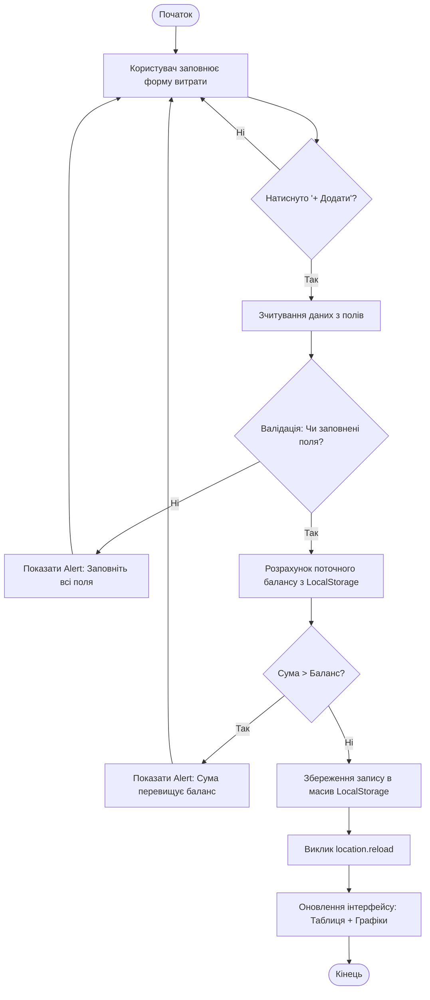
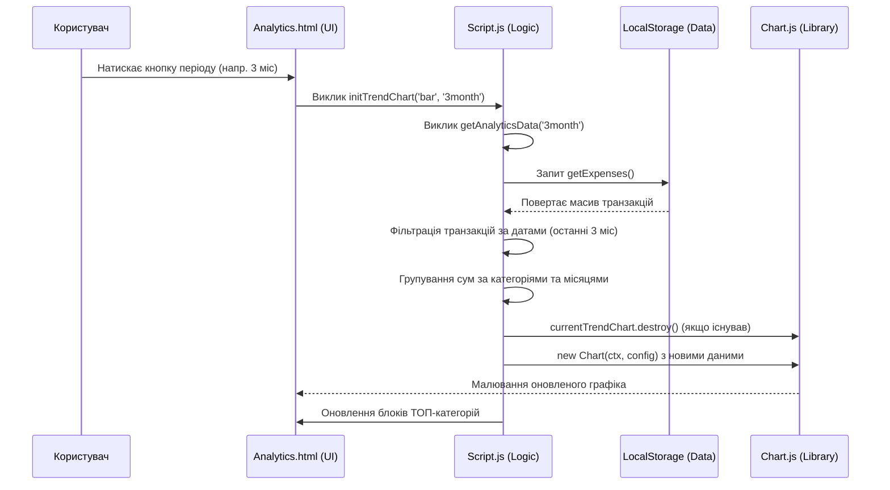

```mermaid
graph TD
    A([Початок]) --> B[Користувач заповнює форму витрати]
    B --> C{Натиснуто '+ Додати'?}
    C -- Ні --> B
    C -- Так --> D[Зчитування даних з полів]
    D --> E{Валідація: Чи заповнені поля?}
    E -- Ні --> F[Показати Alert: Заповніть всі поля]
    F --> B
    E -- Так --> G[Розрахунок поточного балансу з LocalStorage]
    G --> H{Сума > Баланс?}
    H -- Так --> I[Показати Alert: Сума перевищує баланс]
    I --> B
    H -- Ні --> J[Збереження запису в масив LocalStorage]
    J --> K[Виклик location.reload]
    K --> L[Оновлення інтерфейсу: Таблиця + Графіки]
    L --> M([Кінець])
```

```mermaid
    sequenceDiagram
    participant U as Користувач
    participant H as Analytics.html (UI)
    participant S as Script.js (Logic)
    participant L as LocalStorage (Data)
    participant C as Chart.js (Library)

    U->>H: Натискає кнопку періоду (напр. 3 міс)
    H->>S: Виклик initTrendChart('bar', '3month')
    S->>S: Виклик getAnalyticsData('3month')
    S->>L: Запит getExpenses()
    L-->>S: Повертає масив транзакцій
    S->>S: Фільтрація транзакцій за датами (останні 3 міс)
    S->>S: Групування сум за категоріями та місяцями
    S->>C: currentTrendChart.destroy() (якщо існував)
    S->>C: new Chart(ctx, config) з новими даними
    C-->>H: Малювання оновленого графіка
    S->>H: Оновлення блоків ТОП-категорій
```
