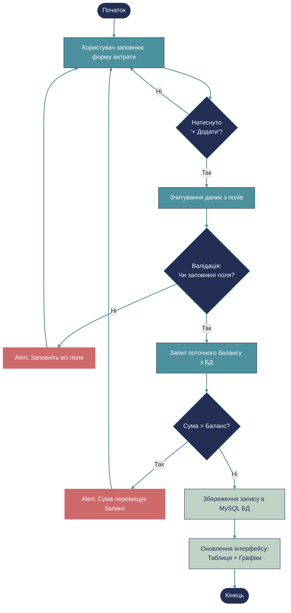
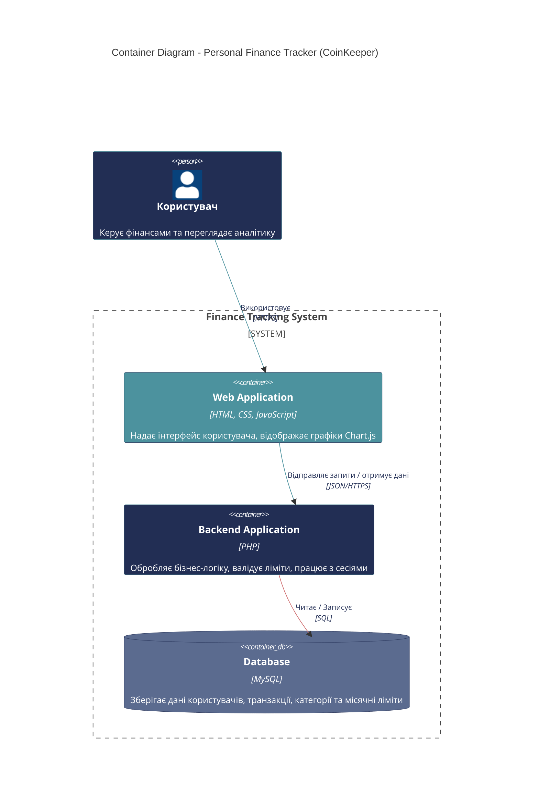
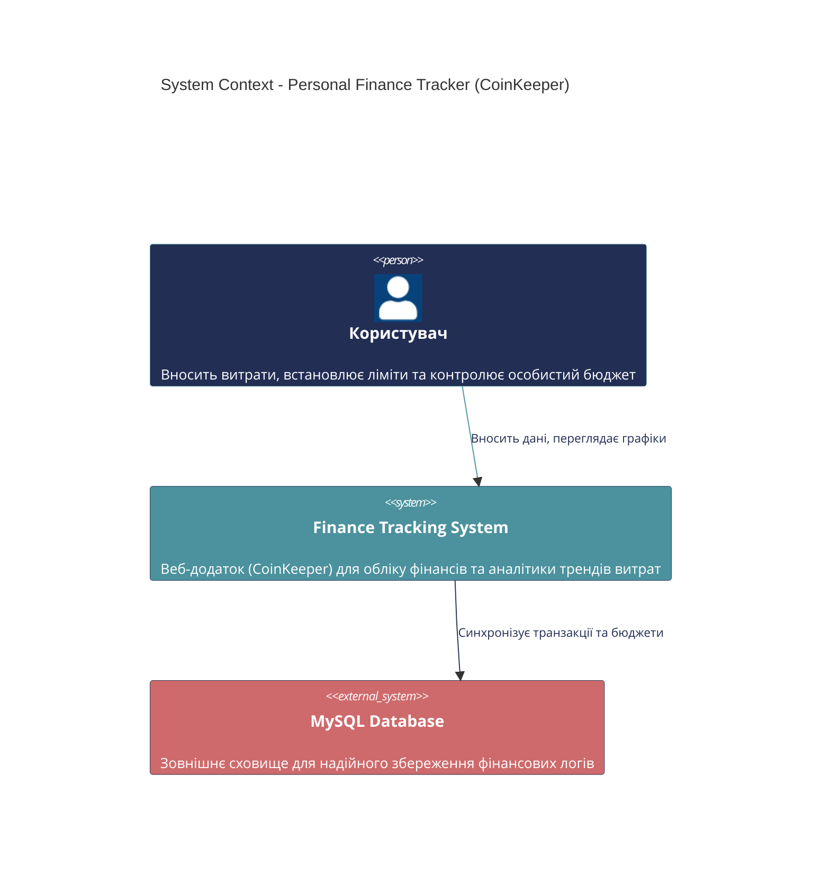
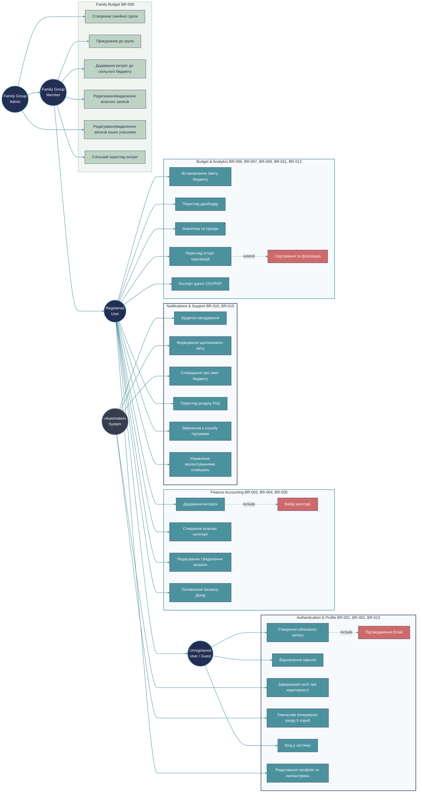

```mermaid
graph TD
    A([Початок]) --> B[Користувач заповнює форму витрати]
    B --> C{Натиснуто<br>'+ Додати'?}
    C -- Ні --> B
    C -- Так --> D[Зчитування даних з полів]
    D --> E{Валідація:<br>Чи заповнені поля?}
    
    E -- Ні --> F[Alert: Заповніть всі поля]
    F --> B
    
    E -- Так --> G[Запит поточного балансу з БД]
    G --> H{Сума > Баланс?}
    
    H -- Так --> I[Alert: Сума перевищує баланс]
    I --> B
    
    H -- Ні --> J[Збереження запису в MySQL БД]
    J --> L[Оновлення інтерфейсу:<br>Таблиця + Графіки]
    L --> M([Кінець])

    %% Стилізація під кольори CoinKeeper
    style A fill:#222e54,stroke:#222e54,color:#fff
    style M fill:#222e54,stroke:#222e54,color:#fff
    style B fill:#4c929e,stroke:#222e54,color:#fff
    style D fill:#4c929e,stroke:#222e54,color:#fff
    style G fill:#4c929e,stroke:#222e54,color:#fff
    style L fill:#bed3c4,stroke:#222e54,color:#222e54
    style J fill:#bed3c4,stroke:#222e54,color:#222e54
    
    style C fill:#222e54,stroke:#4c929e,color:#fff
    style E fill:#222e54,stroke:#4c929e,color:#fff
    style H fill:#222e54,stroke:#4c929e,color:#fff
    
    style F fill:#ce6a6c,stroke:#ce6a6c,color:#fff
    style I fill:#ce6a6c,stroke:#ce6a6c,color:#fff

    %% Кольори стрілок
    linkStyle default stroke:#4c929e,stroke-width:2px;
```

```mermaid
C4Container
    title Container Diagram - Personal Finance Tracker (CoinKeeper)

    Person(user, "Користувач", "Керує фінансами та переглядає аналітику")

    System_Boundary(system, "Finance Tracking System") {
        Container(frontend, "Web Application", "HTML, CSS, JavaScript", "Надає інтерфейс користувача, відображає графіки Chart.js")
        Container(backend, "Backend Application", "PHP", "Обробляє бізнес-логіку, валідує ліміти, працює з сесіями")
        ContainerDb(db, "Database", "MySQL", "Зберігає дані користувачів, транзакції, категорії та місячні ліміти")
    }

    Rel(user, frontend, "Використовує", "HTTPS")
    Rel(frontend, backend, "Відправляє запити / отримує дані", "JSON/HTTPS")
    Rel(backend, db, "Читає / Записує", "SQL")

    %% Стилізація C4 під палітру проєкту
    UpdateElementStyle(user, $bgColor="#222e54", $fontColor="#ffffff", $borderColor="#4c929e")
    UpdateElementStyle(frontend, $bgColor="#4c929e", $fontColor="#ffffff", $borderColor="#222e54")
    UpdateElementStyle(backend, $bgColor="#222e54", $fontColor="#ffffff", $borderColor="#4c929e")
    UpdateElementStyle(db, $bgColor="#5b6b8f", $fontColor="#ffffff", $borderColor="#222e54")
    
    UpdateRelStyle(user, frontend, $lineColor="#4c929e", $textColor="#222e54")
    UpdateRelStyle(frontend, backend, $lineColor="#4c929e", $textColor="#222e54")
    UpdateRelStyle(backend, db, $lineColor="#ce6a6c", $textColor="#222e54")
```

```mermaid
C4Context
    title System Context - Personal Finance Tracker (CoinKeeper)

    Person(user, "Користувач", "Вносить витрати, встановлює ліміти та контролює особистий бюджет")
    System(system, "Finance Tracking System", "Веб-додаток (CoinKeeper) для обліку фінансів та аналітики трендів витрат")
    System_Ext(db, "MySQL Database", "Зовнішнє сховище для надійного збереження фінансових логів")

    Rel(user, system, "Вносить дані, переглядає графіки")
    Rel(system, db, "Синхронізує транзакції та бюджети")

    %% Стилізація Context
    UpdateElementStyle(user, $bgColor="#222e54", $fontColor="#ffffff", $borderColor="#4c929e")
    UpdateElementStyle(system, $bgColor="#4c929e", $fontColor="#ffffff", $borderColor="#222e54")
    UpdateElementStyle(db, $bgColor="#ce6a6c", $fontColor="#ffffff", $borderColor="#222e54")

    UpdateRelStyle(user, system, $lineColor="#4c929e", $textColor="#222e54")
    UpdateRelStyle(system, db, $lineColor="#222e54", $textColor="#222e54")
```

```mermaid
graph LR
    %% Актори (Actors)
    Guest((Unregistered<br>User / Guest))
    User((Registered<br>User))
    FamilyMember((Family Group<br>Member))
    Admin((Family Group<br>Admin))
    SystemNode((«Automated»<br>System))

    %% Зв'язки успадкування акторів
    User --> Guest
    FamilyMember --> User
    Admin --> FamilyMember

    %% БЛОК 1: Автентифікація та Профіль
    subgraph AuthProfile [Authentication & Profile BR-001, BR-002, BR-013]
        UC_Reg[Створення облікового запису]
        UC_Confirm[Підтвердження Email]
        UC_Reset[Відновлення паролю]
        UC_Timeout[Завершення сесії при неактивності]
        UC_Lock[Тимчасове блокування входу 5 спроб]
        UC_Login[Вхід у систему]
        UC_Profile[Редагування профілю та налаштувань]
        
        UC_Reg -.->|include| UC_Confirm
    end

    %% БЛОК 2: Сповіщення та Підтримка
    subgraph NotifSupport [Notifications & Support BR-010, BR-015]
        UC_Remind[Щоденні нагадування]
        UC_Weekly[Формування щотижневого звіту]
        UC_Alert[Сповіщення про ліміт бюджету]
        UC_FAQ[Перегляд розділу FAQ]
        UC_Support[Звернення у службу підтримки]
        UC_NotifyManage[Управління налаштуваннями сповіщень]
    end

    %% БЛОК 3: Облік фінансів
    subgraph FinAccounting [Finance Accounting BR-003, BR-004, BR-005]
        UC_AddExp[Додавання витрати]
        UC_Cat[Вибір категорії]
        UC_CreateCat[Створення власної категорії]
        UC_EditExp[Редагування / Видалення витрати]
        UC_AddInc[Поповнення балансу Дохід]
        
        UC_AddExp -.->|include| UC_Cat
    end

    %% БЛОК 4: Бюджет та Аналітика
    subgraph BudgetAnalytics [Budget & Analytics BR-006, BR-007, BR-008, BR-011, BR-012]
        UC_SetLimit[Встановлення ліміту бюджету]
        UC_Dash[Перегляд дашборду]
        UC_Trend[Аналітика та тренди]
        UC_History[Перегляд історії транзакцій]
        UC_Filter[Сортування та фільтрація]
        UC_Export[Експорт даних CSV/PDF]
        
        UC_History -.->|extend| UC_Filter
    end

    %% БЛОК 5: Сімейний бюджет
    subgraph FamilyBudget [Family Budget BR-009]
        UC_FamCreate[Створення сімейної групи]
        UC_FamJoin[Приєднання до групи]
        UC_FamAdd[Додавання витрат до спільного бюджету]
        UC_FamEditOwn[Редагування/видалення власних записів]
        UC_FamManage[Редагування/видалення записів інших учасників]
        UC_FamView[Спільний перегляд витрат]
    end

    %% Зв'язки: Гість
    Guest --> UC_Reg
    Guest --> UC_Reset
    Guest --> UC_Login

    %% Зв'язки: Система
    SystemNode --> UC_Timeout
    SystemNode --> UC_Lock
    SystemNode --> UC_Remind
    SystemNode --> UC_Weekly
    SystemNode --> UC_Alert

    %% Зв'язки: Користувач
    User --> UC_Profile
    User --> UC_FAQ
    User --> UC_Support
    User --> UC_NotifyManage
    User --> UC_AddExp
    User --> UC_CreateCat
    User --> UC_EditExp
    User --> UC_AddInc
    User --> UC_SetLimit
    User --> UC_Dash
    User --> UC_Trend
    User --> UC_History
    User --> UC_Export

    %% Зв'язки: Член сім'ї та Admin
    FamilyMember --> UC_FamJoin
    FamilyMember --> UC_FamAdd
    FamilyMember --> UC_FamEditOwn
    FamilyMember --> UC_FamView
    
    Admin --> UC_FamCreate
    Admin --> UC_FamManage

    %% СТИЛІЗАЦІЯ ПІД КОЛЬОРИ COINKEEPER
    style Guest fill:#222e54,stroke:#4c929e,stroke-width:2px,color:#fff
    style User fill:#222e54,stroke:#4c929e,stroke-width:2px,color:#fff
    style FamilyMember fill:#222e54,stroke:#4c929e,stroke-width:2px,color:#fff
    style Admin fill:#222e54,stroke:#4c929e,stroke-width:2px,color:#fff
    style SystemNode fill:#363e4d,stroke:#718096,stroke-width:2px,color:#fff

    %% Стилі для підсистем (Subgraphs) через безпечні ID
    style AuthProfile fill:#f7fafc,stroke:#222e54,stroke-width:2px
    style NotifSupport fill:#f7fafc,stroke:#222e54,stroke-width:2px
    style FinAccounting fill:#f7fafc,stroke:#4c929e,stroke-width:2px
    style BudgetAnalytics fill:#f7fafc,stroke:#4c929e,stroke-width:2px
    style FamilyBudget fill:#f0f5f2,stroke:#bed3c4,stroke-width:2px

    %% Стилі для Use Cases (Овалів)
    classDef default fill:#4c929e,stroke:#222e54,stroke-width:1px,color:#fff;
    classDef relations fill:#ce6a6c,stroke:#222e54,stroke-width:1px,color:#fff;
    classDef family fill:#bed3c4,stroke:#222e54,stroke-width:1px,color:#222e54;

    class UC_Confirm,UC_Cat,UC_Filter relations;
    class UC_FamCreate,UC_FamJoin,UC_FamAdd,UC_FamEditOwn,UC_FamManage,UC_FamView family;

    %% Кольори ліній
    linkStyle default stroke:#4c929e,stroke-width:1.5px;

```
