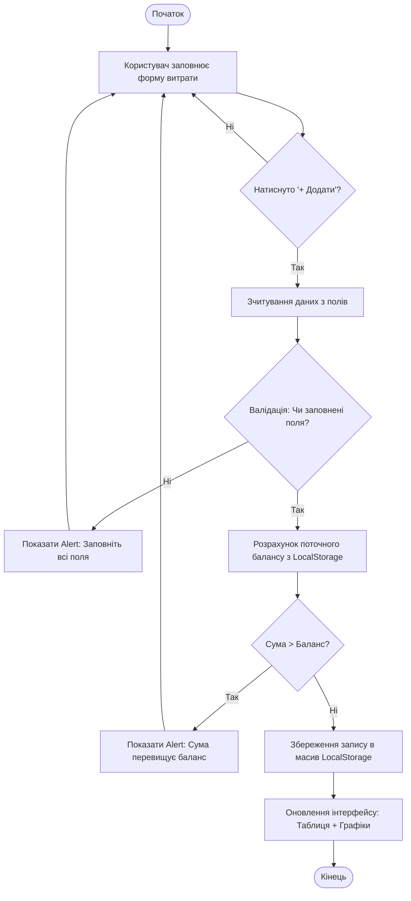

```mermaid
graph TD
    A([Початок]) --> B[Користувач заповнює форму витрати]
    B --> C{Натиснуто '+ Додати'?}
    C -- Ні --> B
    C -- Так --> D[Зчитування даних з полів]
    D --> E{Валідація: Чи заповнені поля?}
    E -- Ні --> F[Показати Alert: Заповніть всі поля]
    F --> B
    E -- Так --> G[Розрахунок поточного балансу з LocalStorage]
    G --> H{Сума > Баланс?}
    H -- Так --> I[Показати Alert: Сума перевищує баланс]
    I --> B
    H -- Ні --> J[Збереження запису в масив LocalStorage]
    J --> L[Оновлення інтерфейсу: Таблиця + Графіки]
    L --> M([Кінець])
```
